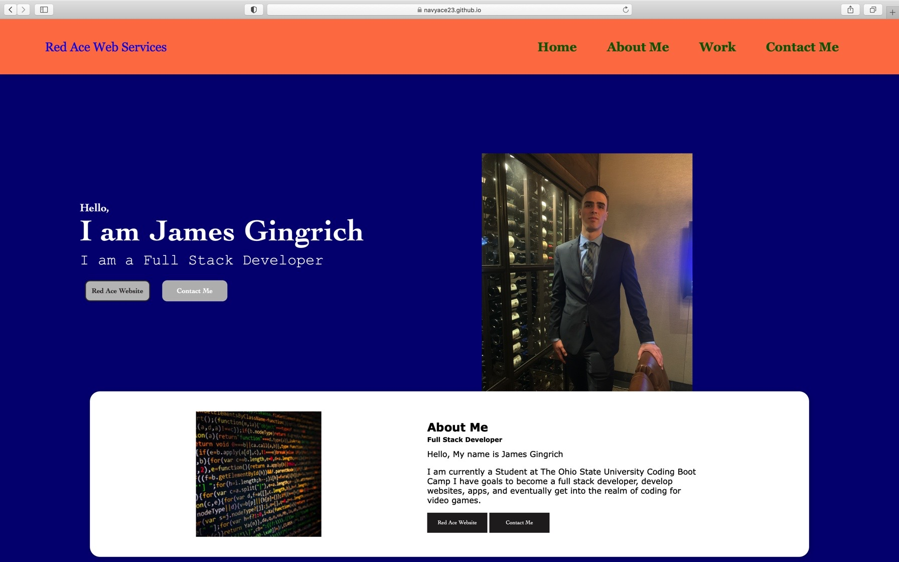

# Professional-Portfolio
## Introduction
I was assigned to create a personal professional portfolio that showcases my current skills
as a developer. As I progress in my coding bootcamp at The Ohio State University I will
add more applications to the deployment and improve on my previous submissions. The idea
behind this project is to have me be employer competitive with a portfolio the showcases 
what I am capable of.
### Link to deployment
https://jamesgingrich.github.io/Professional-Portfolio/
#### Screenshot of Deployment

